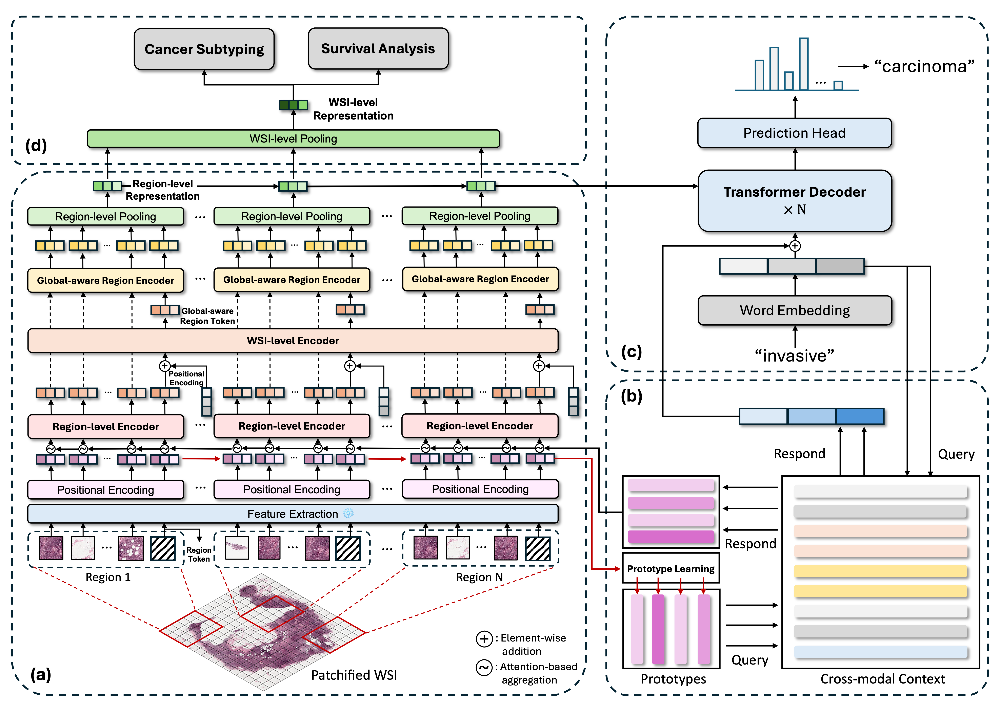

# Dataset, model weight, source code for paper "HistGen: Histopathology Report Generation via Local-Global Feature Encoding and Cross-modal Context Interaction"

### ✨ **We are glad to announce that our paper is accepted by MICCAI2024!!**

This repo contains the dataset, model weight, and source code for paper "HistGen: Histopathology Report Generation via Local-Global Feature Encoding and Cross-modal Context Interaction". We only support PyTorch for now. See our paper for a detailed description of **HistGen**.

**HistGen: Histopathology Report Generation via Local-Global Feature Encoding and Cross-modal Context Interaction**\
*Zhengrui Guo, Jiabo Ma, Yingxue Xu, Yihui Wang, Liansheng Wang, and Hao Chen*\
Paper: <https://arxiv.org/abs/2403.05396>

<!-- Link to our paper: [[arxiv]](https://arxiv.org/abs/2403.05396) -->

### Highlight of our work
- We introduce **HistGen**, a multiple instance learning-empowered framework for histopathology report generation together with the first benchmark dataset for evaluation. 
- Inspired by diagnostic and report-writing workflows, HistGen features two delicately designed modules, aiming to boost report generation by aligning whole slide images (WSIs) and diagnostic reports from local and global granularity. 
- To achieve this, a local-global hierarchical encoder is developed for efficient visual feature aggregation from a region-to-slide perspective. Meanwhile, a cross-modal context module is proposed to explicitly facilitate alignment and interaction between distinct modalities, effectively bridging the gap between the extensive visual sequences of WSIs and corresponding highly summarized reports. 
- Experimental results on WSI report generation show the proposed model outperforms state-of-the-art (SOTA) models by a large margin. Moreover, the results of fine-tuning our model on cancer subtyping and survival analysis tasks further demonstrate superior performance compared to SOTA methods, showcasing strong transfer learning capability.

### Methodology

Overview of the proposed HistGen framework: (a) local-global hierarchical encoder module, (b) cross-modal context module, (c) decoder module, (d) transfer learning strategy for cancer diagnosis and prognosis.

## Table of Contents
- [Dataset, model weight, source code for paper "HistGen: Histopathology Report Generation via Local-Global Feature Encoding and Cross-modal Context Interaction"](#dataset-model-weight-source-code-for-paper-histgen-histopathology-report-generation-via-local-global-feature-encoding-and-cross-modal-context-interaction)
    - [Highlight of our work](#highlight-of-our-work)
    - [Methodology](#methodology)
  - [Table of Contents](#table-of-contents)
  - [TO-DO](#to-do)
  - [Prerequisite](#prerequisite)
  - [HistGen WSI-report dataset](#histgen-wsi-report-dataset)
  - [Preprocessing and Feature Extraction with Pre-trained DINOv2 ViT-L](#preprocessing-and-feature-extraction-with-pre-trained-dinov2-vit-l)
  - [HistGen WSI Report Generation Model](#histgen-wsi-report-generation-model)
    - [Training](#training)
    - [Inference](#inference)
    - [Transfer to Downstream Tasks](#transfer-to-downstream-tasks)
  - [Issues](#issues)
  - [License and Usage](#license-and-usage)

## News
- **2024-12-18**: Tokenizer for HistGen is uploaded, better decoding capability is unlocked. Check modules.tokenizers for details.
- **2024-12-18**: Ground Truth Reports are further cleaned and uploaded. Check the HuggingFace Datasets for more details.
- **2024-12-18**: Baselines models are uploaded.
- **2024-11-12**: HistGen WSI-report dataset is available on HuggingFace Datasets! (Also the annotation files!)
- **2024-08-10**: Codes for feature extraction (CLAM) is uploaded.
- **2024-06-17**: Our paper is accepted by MICCAI2024! 🎉

## TO-DO
- [x] Release the source code for training and testing HistGen
- [x] Release the diagnostic report data
- [x] Release the DINOv2 ViT-L features of WSIs
- [x] Release model weights of pre-trained DINOv2 ViT-L feature extractor
- [x] Release the source code for WSI patching and feature extraction
- [ ] Update checkpoints of HistGen and merge into EasyMIL for cancer diagnosis and survival analysis tasks

## Prerequisite
Follow this instruction to create conda environment and install necessary packages:
```
git clone https://github.com/dddavid4real/HistGen.git
cd HistGen
conda env create -f requirements.yml
```
## HistGen WSI-report dataset
✨ Our curated dataset is now available on HuggingFace Datasets! Click [here](https://huggingface.co/datasets/david4real/HistGen) to access the dataset. In the **Files and Versions** section, you could find the extracted DINOv2 features of WSIs with name *DINOv2_Features.z01~z14* and *DINOv2_Features.zip*. Please download all of them and then run the following commands to unzip the files:
```
zip -FF DINOv2_Features.zip --out WSI_Feature_DINOv2.zip
unzip WSI_Feature_DINOv2.zip
``` 
~~Also, the paired diagnostic reports can be found from the above link with name *annotations.json*.~~\
🌟 **Update**: The ground truth reports are further cleaned and uploaded. You could find the cleaned reports with name *annotations712_update.json*, which provides smoother and more precise descripted reports. Meanwhile, the train:val:test sets are split into 7:1:2.
<!-- Our curated dataset could be downloaded from [here](https://hkustconnect-my.sharepoint.com/:f:/g/personal/zguobc_connect_ust_hk/EhmtBBT0n2lKtiCQt97eqcEBvO9WwNM3TL9x-7-kg_liuA). -->

The structure of this fold is shown as follows:
```
HistGen WSI-report dataset/
|-- WSIs
|    |-- slide_1.svs
|    |-- slide_2.svs
|    ╵-- ...
|-- dinov2_vitl
|        |-- slide_1.pt
|        |-- slide_2.pt
|        ╵-- ...
╵-- annotation.json
```
in which **WSIs** denotes the original WSI data from TCGA, **dinov2_vitl** is the features of original WSIs extracted by our pre-trained DINOv2 ViT-L backbone, and **annotation.json** contains the diagnostic reports and case ids of their corresponding WSIs. Concretely, the structure of this file is like this:
```
{
    "train": [
        {
            "id": "TCGA-A7-A6VW-01Z-00-DX1.1BC4790C-DB45-4A3D-9C97-92C92C03FF60",
            "report": "Final Surgical Pathology Report Procedure: Diagnosis A. Sentinel lymph node, left axilla ...",
            "image_path": [
                "/storage/Pathology/wsi-report/wsi/TCGA-A7-A6VW-01Z-00-DX1.1BC4790C-DB45-4A3D-9C97-92C92C03FF60.pt"
            ],
            "split": "train"
        },
        ...
    ],

    "val": [
        {
            "id": "...",
            "report": "...",
            "image_path": ["..."],
            "split": "val"
        },
        ...
    ],

    "test": [
        {
            "id": "...",
            "report": "...",
            "image_path": ["..."],
            "split": "test"
        },
        ...
    ]
}
```
~~in which we have already split into train/val/test subsets with ratio 8:1:1.~~\
"id" denotes the case id of this report's corresponding WSI, "report" is the full refined text obtained after our proposed report cleaning pipeline, and "image_path" could be just ignored. 

To reproduce our proposed HistGen model, please download the **dinov2_vitl** directory together with **annotation712_update.json**.

<!-- Note that before you use this json file for training, please run the `replace_pt_path.py` we provided to change the "image_path". Usage of `replace_pt_path.py` is written inside the python file. -->

## Preprocessing and Feature Extraction with Pre-trained DINOv2 ViT-L

### WSI Preprocessing
In this work, we adpoted and further accelerated [CLAM](https://github.com/mahmoodlab/CLAM) for preprocessing and feature extraction. We uploaded the minimal viable version of CLAM to this repo. For installation guide, we recommend to follow the original instructions [here](https://github.com/mahmoodlab/CLAM/blob/master/docs/INSTALLATION.md). To conduct preprocessing, please run the following commands:
```
cd HistGen
cd CLAM
conda activate clam
sh patching_scripts/tcga-wsi-report.sh
```

### Feature Extraction
To extract features of WSIs, please run the following commands:
```
cd HistGen
cd CLAM
conda activate clam
sh extract_scripts/tcga-wsi-report.sh
```
in which we provide the ImageNet-pretrained ResNet, [Ctranspath](https://github.com/Xiyue-Wang/TransPath), [PLIP](https://github.com/PathologyFoundation/plip), and our pre-trained DINOv2 ViT-L feature extractor. Note that Ctranspath requires specific timm environment, see [here](https://github.com/Xiyue-Wang/TransPath) for more info.

🌟If Git LFS fails, please download the model checkpoint of our pre-trained DINOv2 feature extractor from this [link](https://huggingface.co/datasets/david4real/HistGen). You could find the checkpoint for our pretrained DINOv2 feature extractor with name *dinov2_cpath_v1.pth*. After downloading, put it under HistGen/CLAM/models/ckpts/ .

🌟 Note that if loading DINOv2 checkpoint runs into problems, the most possible case is that your checkpoint is broken, please redownload from the above link. 

## HistGen WSI Report Generation Model
### Training
To try our model for training, validation, and testing, simply run the following commands:
```
cd HistGen
conda activate histgen
sh train_wsi_report.sh
```
Before you run the script, please set the path and other hyperparameters in `train_wsi_report.sh`. Note that **--image_dir** should be the path to the **dinov2_vitl** directory, and **--ann_path** should be the path to the **annotation712_update.json** file.

🌟 **Update:** we have included baseline models in our paper for training, including R2Gen, R2GenCMN, Show&Tell, Transformer, M2Transformer, and UpDownAtt modeles. Note that they are not originally designed to process WSIs, thus enormous number of patches in a WSI may lead to unaffordable computational overhead. Thus, we implement a simple image token selection mechanism before processing these patch tokens by these models, "uniform sampling", "cross attention", and "kmeans clustering" are provided. And selected token number can be chosen in the script "train_wsi_report_baselines.sh". To train one of these baseline models, please run the following commands:
```
cd HistGen
conda activate histgen
sh train_wsi_report_baselines.sh
```

### Inference
To generate reports for WSIs in test set, you can run the following commands:
```
cd HistGen
conda activate histgen
sh test_wsi_report.sh
```
Similarly, remember to set the path and other hyperparameters in `test_wsi_report.sh`.

### Transfer to Downstream Tasks
In this paper, we consider WSI report generation task as an approach of vision-language pre-training, and we further fine-tune the pre-trained model on cancer subtyping and survival analysis tasks, with the strategy shown in [Methodology](#methodology) subfigure (d). For the implementation of downstream tasks, we recommend to use the [EasyMIL](https://github.com/birkhoffkiki/EasyMIL) repository, which is a flexible and easy-to-use toolbox for multiple instance learning (MIL) tasks developed by our team.

We are currently organizing the pre-trained checkpoints and merging HistGen into EasyMIL. Please stay tuned for the update.

## Issues
- Please open new threads or report issues directly (for urgent blockers) to `zguobc@connect.ust.hk`
- Immediate response to minor issues may not be available.

## License and Usage
If you find our work useful in your research, please consider citing our paper at:
```
@inproceedings{guo2024histgen,
  title={Histgen: Histopathology report generation via local-global feature encoding and cross-modal context interaction},
  author={Guo, Zhengrui and Ma, Jiabo and Xu, Yingxue and Wang, Yihui and Wang, Liansheng and Chen, Hao},
  booktitle={International Conference on Medical Image Computing and Computer-Assisted Intervention},
  pages={189--199},
  year={2024},
  organization={Springer}
}
```
This repo is made available under the Apache-2.0 License. For more details, please refer to the LICENSE file.
